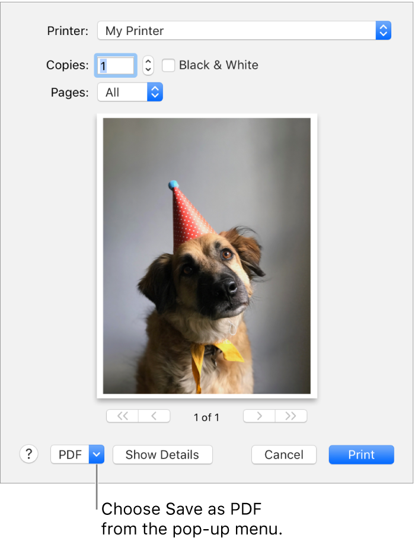

# EXPORT IBOOKS NOTES into Anki by emailing the notes to your yourself and importing the csv file

## Step 1 – Inside iBooks, you can click on a book.

## Step 2 – Click on the book you want to get the highlights from.

Figure A: You have to access the notes by clicking the menu button in the top left corner (beside library). Then, you can access notes and do things with them.


## Step 3: Click the menu button next to Library at the top (See Figure A)

Figure B: Before you can do anything with the notes, you have to view the notes in iBooks.


## Step 4: Click on 'Notes' (Figure B)

Figure C. You have to choose to Edit the notes so that you can select what you want to send.


## Step 5: Click on the arrow at the top right corner and click “Edit notes.” (Figure C)

Figure D: You can select all of the notes in iBooks. This means that you’ll probably want to do this when you FINISH reading a book, otherwise you have to click the check by each highlight or note individually on the right.


## Step 6: Click Select all (top left corner) (Figure D)

Figure E This is how you send notes to mail.


## Step 7: Click Share (next to Select all/ Select None) and then Choose Mail (Figure E)

Figure F – This shot shows the note in my email. I’ve addressed it to my Evernote email address that I got from inside Evernote so that I can send it directly to Evernote.
Note that you can also copy and paste out of this note if you wanted to move the notes to Pages or such.


## Step 8: Choose Mail and send the email to yourself. (Figure F)

## Step 9: In the email choose to print the email to PDF



## Step 10: Clone the repo

```shell
git clone git@github.com:bf4648/ibooks2anki.git

```

## Step 11: Select all the notes in your email and copy them to your clipboard.

## Step 12: Run the createCSVFromiBooks.fish script from the terminal


```shell
brew install fish
cd /path/to/repo
./createCSVFromiBooks.fish
```

## Step 13: Import the csv file into Anki

```shell
In ANKI choose File > Import > choose the csv file in ~/Downloads dir
```
